In recent years, one of the biggest applications of machine learning has been in image classification — the ability for a computer to intelligently recognize an object. Such work is being done at the greatest technology companies, and it’s since spawned this unwarranted notion of exclusivity. We’ve crafted a narrative that in order to get your hands dirty with machine learning and artificial intelligence, you have to be some sort of certifiable genius, or at least an engineering graduate just to break in. So I’m going to to show you how in less than 45 minutes, you can build a fully-functioning image classifier that can recognize any (yes, any) object with insanely high probabilities.

## Learning objectives

After completing this how-to, the reader will be able to:

* Learn Watson Studio to build a image classification model using image data from any source.
* Build an android application which classify images using the model.

## Prerequisites

* IBM Cloud account - [sign up](https://console.bluemix.net/registration/) if you don't have an account yet.

* Enough space on IBM Cloud for 3 services. If not, delete some services to make room.

* You will require Android Studio, download the latest version [Android Studio 3.1.3](https://developer.android.com/studio/)

* Install [JAVA JDK SE 8](http://www.oracle.com/technetwork/java/javase/downloads/jdk8-downloads-2133151.html)

* A dataset that you want to model.

    If you don't have your own dataset, then you can download this [Sample Dataset](https://github.com/sudoalgorithm/Developing-A-Image-Classifier-Using-Watson-Visual-Recognition-On-Watson-Studio-Dataset.git)

## Estimated time

To complete this how-to it should take around 45 minutes.

## Steps

### Setting up Watson Studio for first time

Watson Studio is a cloud based development and deployment environment for Machine Learning, Deep Learning, Data Governance and Data Expolaration. A platform build for business analyst, data engineer, data scientist and developer to simply there task with an intuitive UI and provide massive computing power. A platform where insights can be traced back to models, projects, notebooks and data sources and where model can evolve and automatically update themselves.

* Navigate to [datascience.ibm.com](https://www.ibm.com/cloud/watson-studio)


* Sign in on the IBM Cloud

### Get Started on Watson Studio

* Click on **Get Started** and you will be redirected to the Watson Studio dashboard.

* An interactive menu will be shown **Get started with key tasks**.

### Create Project

* Click on New Project and select **Watson Tools**.

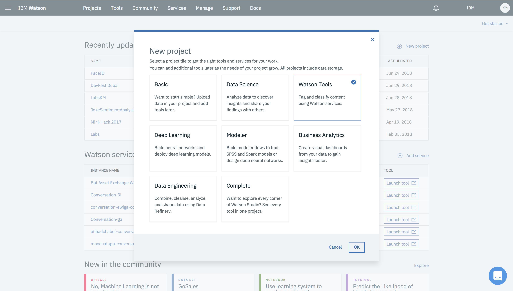

* On selecting **Watson Tools** project tile, two services i.e **Object Storage** and **Watson Visual Recognition** will be created in your IBM cloud dashboard.

* Enter **Project Name**, **details** (optional), choosing **Restrict who can be a collaborator** (optional). Notice on the side that **Object Storage** and **Watson Visual Recognition** services are selected.

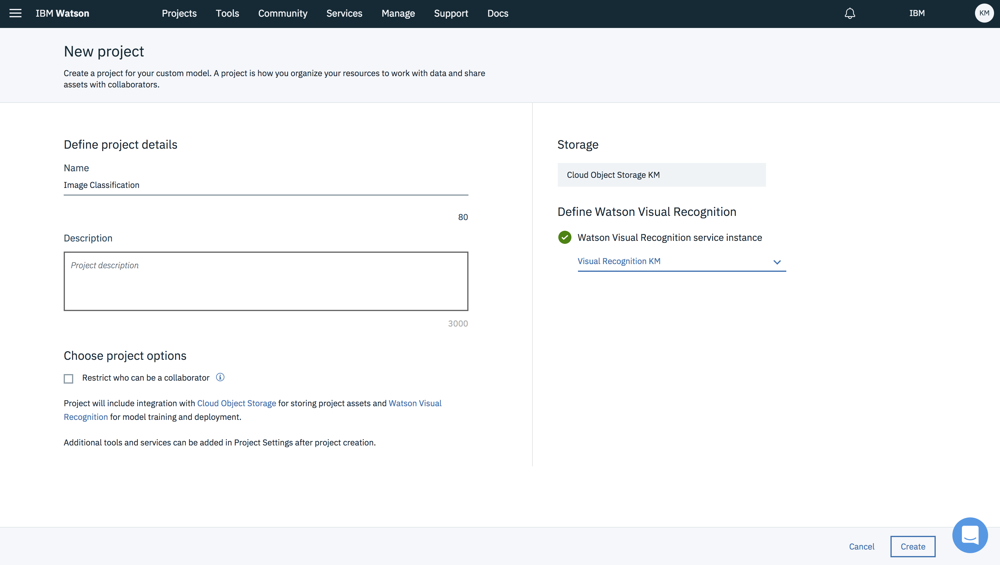

* If by some error in the server they are not created, they can be added from the drop-down list too via Watson Studio.
* Project dashboard will be shown. That will have tabs like **Overview**, **Assets**, **Bookmarks**, **Access Control**, **Settings**.
* Select the **Assets** tab.

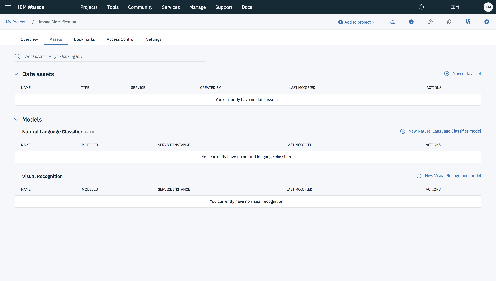

### Add data asset

* Click on **New data asset**.
* A side navigation drawer will open with **Load** tab selected.


* Click on **browse** or simply **drag and drop** the data assets of your project.
    (Note:- In case of Watson Visual Recognition project, have your data assets in a zip file).


### Create a Model

* Click on **New Visual Recognition model**.


* New dashboard will open with model names as **Default Custom Model**. Dashboard will show two tabs **My Classes** and **All Images**.
* In the **My Classes** tab click on **Create a class** and create a class you want to classify. (Note:- class of an image, it relates to the object classification task).

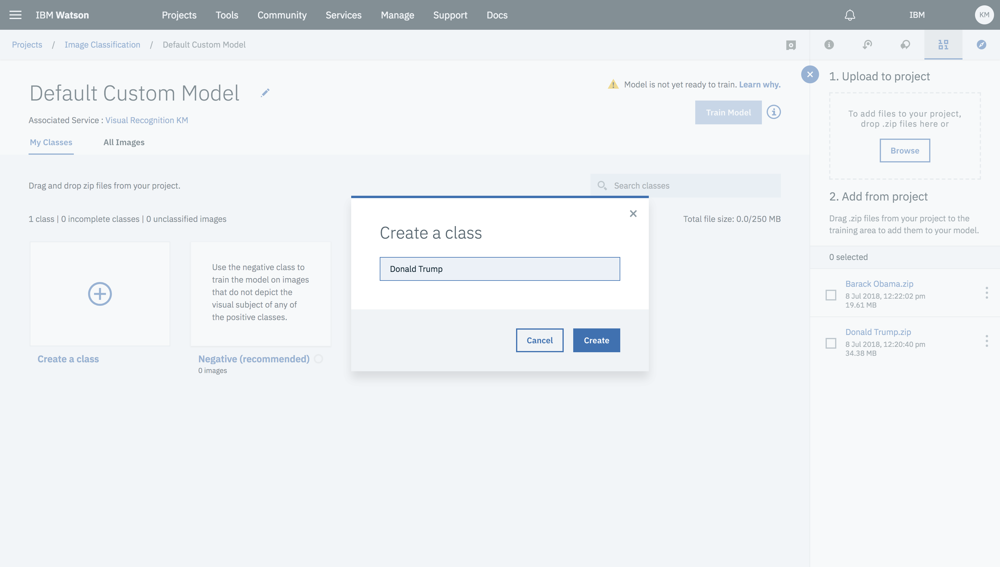

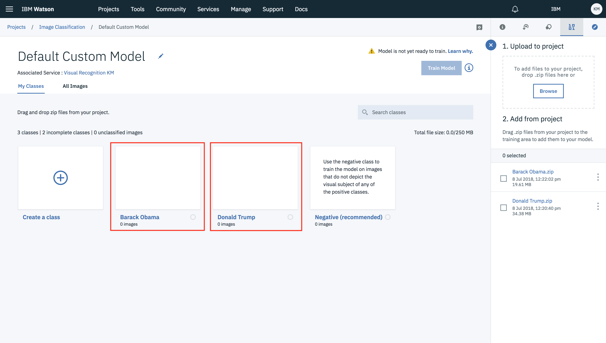

* Click on the created **class** and add the data asset to it by selected the data asset and clicking on **Add to model**.

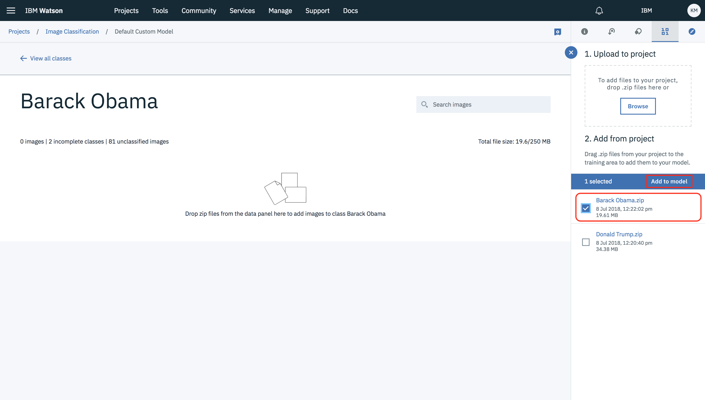

* Once data assets have been added to the respective classes click on **Train Model** button.

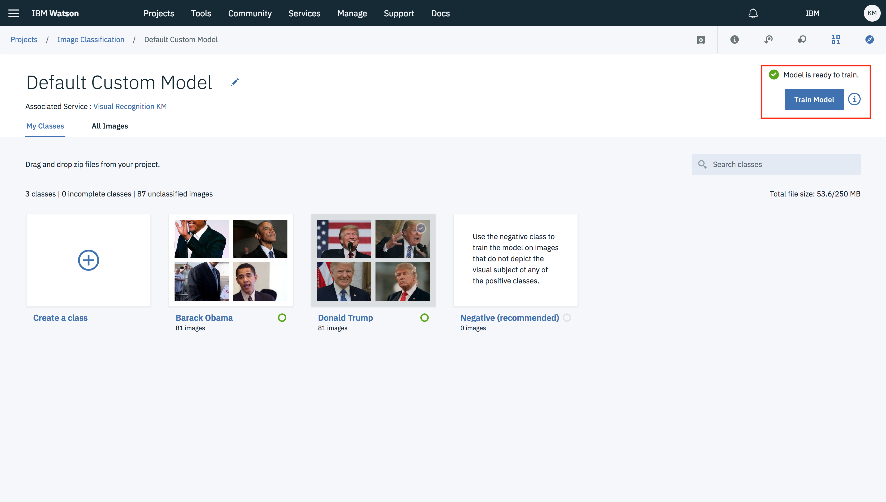

* Process will take around 10-15 min to train the model for respective classes.

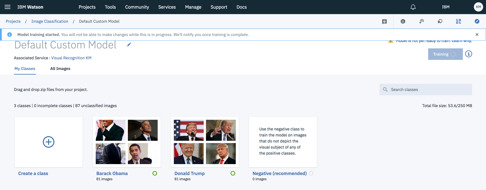

### Test Model

* Once the traning is complete click on **here** in the snakbar.


* A new dashboard will open having three tabs

1. **Overview**
2. **Test**
3. **Implementation**

* Click on the **Test** tab.

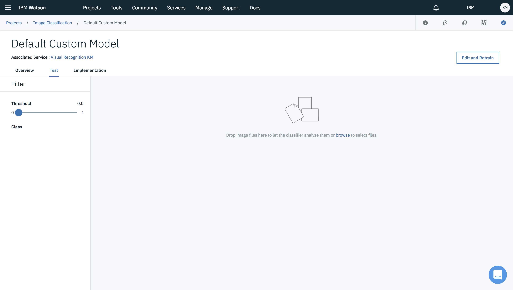

* Take a test image from any source and click on **browse** or simply **drag and drop** the image on to the dashboard.
* After loading the image into image classifier, it run the image classification algorithm which returns the accuracy within the range from 0 to 1 that identifies your class or object.

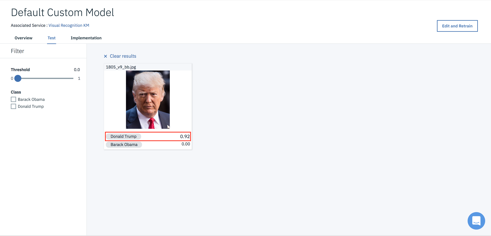

### Building the client side application (Android App).

* Start **Android Studio** and create a **new project**.

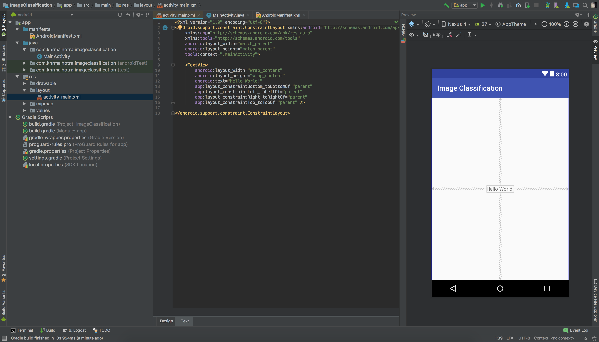

* Go back to your model in watson studio and click on **Implementation** tab.
* Under the **Implementation** tab look for Java on the left hand side navigation drawer and select it. You will find the code required to communicate with the model.

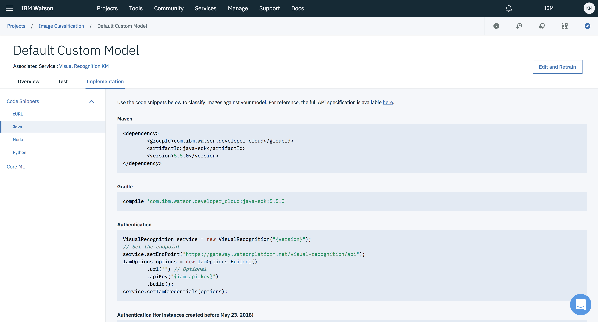

* In Android Studio under **Gradle Scripts/build.gradle (Module:app)**. Add ```implementation 'com.ibm.watson.developer_cloud:java-sdk:5.5.0'``` in the **dependencies block** and click on **Sync Now**.

* After the sync process is complete, go to **MainActivity** under the **java/package_name.project_name/** and add two global object
1. VisualRecognition
2. CameraHelper

```
VisualRecognition mVisualRecognition;
CameraHelper mCameraHelper;
```


